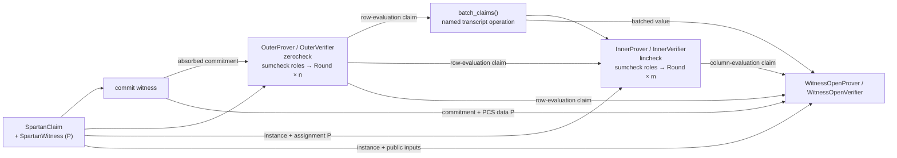

# zorch

> **SNARK = Σ IOP Round**

This is an implementation-layer mnemonic: repeated IOP rounds are the core
interactive computation. A full non-interactive argument also includes its
relation/compiler, transcript transform, and commitment machinery (when the
scheme uses them).

FRX-native building blocks for proof systems. `zorch` sits between **FRX** —
Fractalyze's fork of [JAX](https://github.com/jax-ml/jax) — and the proof systems
that consume it: FRX provides tracing and codegen, lowered through **Fractalyze
XLA**, its fork of stock [XLA](https://github.com/openxla/xla) that adds native
field and elliptic-curve types. `zorch` provides the reusable pieces a proof
system is assembled from.

A polynomial-IOP SNARK commonly combines an IOP, polynomial commitments, and a
Fiat–Shamir transform. Folding and other families reuse many of the same
components without fitting that equation literally. zorch separates repeated
protocol rounds from paired proof stages and explicit proof-system pipelines.

## Design Philosophy

- **Proving-scheme-agnostic.** The blocks are reusable across proving schemes,
  rather than encoding a single one. `Round` / Fiat-Shamir / `Polynomial` /
  `PCS` / fold / zero-check
  compose into FRI, sumcheck, GKR, STARK, Basefold, WHIR, …; pairing-based
  schemes plug in by swapping the `PCS` block (e.g. a KZG-style commitment).
- **Implementation-agnostic.** `zorch` targets the proving scheme, not any one
  downstream implementation — a zkVM, a zkML prover, a zkTLS prover. Each plugs
  in as a *consumer*; nothing implementation-specific leaks into a block.
- **Fusion-first.** Each `Round` — and each `commit`/`open`, each
  `absorb`/`squeeze`, each fold step, and a hash permutation's internal rounds —
  must lower to a **single fused kernel**. We get there by *construction*, not
  by a per-primitive pattern-matcher in the compiler.
- **Easy to assemble.** These are building blocks; the API optimizes for snapping
  them together.

## Building blocks

zorch composes protocols at two different scales: repeated **rounds** inside a
protocol component, and paired prover/verifier **stages** at proof boundaries.
Keeping the two scales separate makes it clear which state is one recurrence's
carry and which values are the semantic outputs consumed by the rest of the
proof system.

### Round: repeat one recurrence

A **round** is one step of a homogeneous recurrence, such as eliminating one
sumcheck variable, folding one polynomial dimension, or reducing one GKR layer.
The two roles have different shapes, so they are separate protocols:

```text
ProverRound:    (carry, transcript)          → (carry, transcript, message)
VerifierRound:  (carry, transcript, message) → (carry, transcript, ok)
```

Only the message crosses between the roles, so only the message gets a position
of its own. Anything a round derives rather than receives — a sumcheck round's
challenge, a fold challenge — belongs in the carry: both sides squeeze it from
the transcript, so it never needs to be sent. A sumcheck round records its
challenge into the point it is building; a GKR layer folds its own into the
running claim. Both then report the same thing, a verdict, which is why one
verifier protocol serves every recurrence shape.

The carry is named for what it holds, never `carry` — `RunningClaim` for
sumcheck's replay, `LayerClaim` for a GKR layer, `FoldState` for a commit-and-
fold recurrence.

Use `prove_rounds()` and `verify_rounds()` when every step has the same meaning
for its carry and message. The concrete round objects and message shapes may
vary; the invariant is the recurrence contract. Specialized drivers such as
sumcheck folding can impose stronger shape or fusion rules.

A sequence is not a round recurrence merely because it executes in order.
Setup, a special first interaction, a repeated sumcheck, and terminal claim
derivation have different contracts. Their owning stage should spell out that
orchestration directly.

### Stage: reduce one claim

A **stage** is a paired proof-reduction contract with separately deployable
roles:

```python
ProverStage.prove(claim, witness, transcript)
    -> ProveResult[reduced_claim, reduction_proof]
VerifierStage.verify(claim, reduction_proof, transcript)
    -> VerifyResult[reduced_claim]
```

`Stage(prover, verifier)` can bundle matching role objects for conformance tests
or local orchestration, but deployed code depends only on its role. A verifier
therefore never has to construct or retain a prover object or proving key.

The claim is the public assertion entering the stage; the witness is the
prover's private evidence. Both roles derive the same reduced claim. The
reduction proof establishes the source claim conditional on that reduced claim:

```text
reduced claim is true  =>  source claim is true
```

A later stage proves the reduced claim, and a terminal stage closes the final
claim. The reduced claim in `ProveResult` is an execution value for continuing
the prover, not separately serialized proof data. The verifier reconstructs it
from the source claim, reduction proof, and transcript.

A role implementation may run a recurrence of rounds, perform a PCS operation,
or contain child role implementations. `SumcheckProver` and
`SumcheckVerifier`, for example, implement the two roles that reduce a sum claim
to an evaluation claim through internal per-variable rounds. Compilation boundaries are a
separate performance choice; one stage may contain several compiled regions.

### Example: a composite proof-system stage

`SpartanProver` and `SpartanVerifier` are the two roles of a composite stage.
Their execution order is linear, but their dataflow is not a simple
`reduced claim → next claim` chain. The terminal opening claim
depends on the root claim, commitment, outer reduced claim, batching challenge,
and inner reduced claim. Prover-only PCS data follows a private skip edge.



Each composite role writes this dataflow with ordinary Python, like a PyTorch
module with a custom `forward`. Prover and verifier construct the same child
claims; only the prover supplies witnesses:

```python
# prove()
outer_claim = ZerocheckClaim(instance.s_x)
outer = self.outer.prove(
    outer_claim,
    ZerocheckWitness(az, bz, cz),
    transcript,
)
batch, transcript = batch_claims(outer.reduced_claim.values, outer.transcript)
inner_claim = LincheckClaim(instance, outer.reduced_claim, batch)
inner = self.inner.prove(
    inner_claim,
    LincheckWitness(assignment),
    transcript,
)
opening_claim = witness_opening_claim(
    commitment,
    instance,
    root_claim.public_inputs,
    outer.reduced_claim,
    batch,
    inner.reduced_claim,
)
opening = self.witness_open.prove(
    opening_claim,
    WitnessOpeningWitness(prover_data),
    inner.transcript,
)

# verify()
outer_claim = ZerocheckClaim(instance.s_x)
outer = self.outer.verify(outer_claim, proof.outer, transcript)
batch, transcript = batch_claims(outer.reduced_claim.values, outer.transcript)
inner_claim = LincheckClaim(instance, outer.reduced_claim, batch)
inner = self.inner.verify(inner_claim, proof.inner, transcript)
opening_claim = witness_opening_claim(
    proof.commitment,
    instance,
    root_claim.public_inputs,
    outer.reduced_claim,
    batch,
    inner.reduced_claim,
)
opening = self.witness_open.verify(
    opening_claim,
    proof.witness_open,
    inner.transcript,
)
```

The opening claim is derived from almost the entire preceding pipeline on both
sides. The prover additionally supplies the PCS opening witness. This explicit
parent orchestration preserves fan-out and skip-level dependencies without a
universal context object or adapter stage.

| | **`Round`** | **`Stage`** | **Named protocol operation** |
| --- | --- | --- | --- |
| **Represents** | one step of a repeated recurrence | one conditional claim reduction with separate prover/verifier roles | shared framing, reduction, or security-amplification step without its own proof section |
| **Owns** | recurrence carry, message, and per-step export | shared claim/proof contract; each role owns only its capabilities | no proof section |
| **Examples** | one sumcheck variable, one GKR layer | sumcheck, zerocheck, lincheck, LogUp-GKR, a stage wrapping a PCS opening, Spartan | framed observation, domain separation, grinding, claim batching |
| **Composed by** | a recurrence driver inside a stage role | an explicit parent role implementation | the parent whose transcript and soundness accounting require it |

There is deliberately no separate “bridge” component. A domain separator,
grind, framed observation, or sampled batching challenge does not prove or
verify an independently reusable claim, even when it changes soundness. It is a
named function called at the same point by the owning prover and verifier, with
its preconditions and security contribution documented there.

### Where the classic pieces fit

- **Fiat-Shamir, `Polynomial`, folds, codes, hashing, and commitments** are
  reusable materials used by rounds and stages.
- **Sumcheck** is a `Stage` because it is a paired reduction; its
  per-variable steps are rounds.
- **Univariate-skip sumcheck** is also an ordinary stage, but exports a distinct
  prism-point reduction. A parent expecting an ordinary multilinear evaluation
  point cannot accidentally substitute it.
- **Zerocheck and lincheck** are stages that configure sumcheck and add their
  protocol-specific setup, terminal checks, and exported claims.
- **LogUp-GKR** reduces a public output-and-layer-count claim to an input-layer
  evaluation claim for a consumer's PCS opening.
- **A PCS opening is a stage contract.** `WitnessOpenProver` owns only the
  `PcsProver`; `WitnessOpenVerifier` owns only the `PcsVerifier`. PCS
  implementations do not themselves implement stage roles.
- **A full proof system** can expose composite prover and verifier roles.
  `SpartanVerifier` is constructible with only a PCS verification key.

The full contracts, ownership rules, and reuse guidance live in
[`docs/composition/stage-composition.md`](docs/composition/stage-composition.md).

## Development

`zorch` is pure Python on FRX, run against its GPU plugin. A virtualenv with
the pinned toolchain:

```sh
python3.11 -m venv .venv && . .venv/bin/activate
pip install -r requirements.in \
    --extra-index-url https://fractalyze.github.io/pypi/simple/
```

The dev loop — per-workspace venvs, developing against a local Fractalyze XLA
build, the FRX compile-cache rule — lives in [`docs/reference/development.md`](docs/reference/development.md).

## Documentation

- **Task-indexed docs hub:** [`docs/README.md`](docs/README.md) — indexes every
  design doc by what you're trying to do.

## License

Licensed under the Apache License, Version 2.0 (see [LICENSE](LICENSE)).
