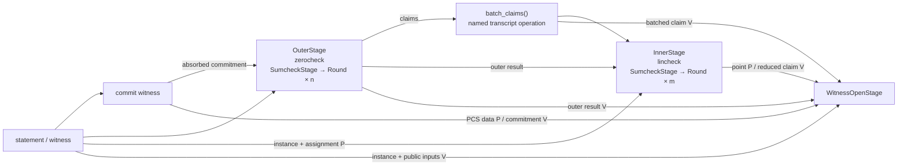

# zorch

> **SNARK = Σ IOP Round**

FRX-native building blocks for Modern SNARKs. `zorch` sits between **FRX** —
Fractalyze's fork of [JAX](https://github.com/jax-ml/jax) — and the proof systems
that consume it: FRX provides tracing and codegen, lowered through **Fractalyze
XLA**, its fork of stock [XLA](https://github.com/openxla/xla) that adds native
field and elliptic-curve types. `zorch` provides the reusable pieces a proof
system is assembled from.

A Modern SNARK is **IOP + PCS**. zorch separates repeated protocol rounds
from coarse proof stages and explicit proof-system pipelines.

## Design Philosophy

- **Proving-scheme-agnostic.** The blocks capture *every* proving scheme, not a
  single one. `Round` / Fiat-Shamir / `Polynomial` / `PCS` / fold / zero-check
  compose into FRI, sumcheck, GKR, STARK, Basefold, WHIR, …; pairing-based
  schemes plug in by swapping the `PCS` block (e.g. a KZG-style commitment).
- **Implementation-agnostic.** `zorch` targets the proving scheme, not any one
  downstream implementation — a zkVM, a zkML prover, a zkTLS prover. Each plugs
  in as a *consumer*; nothing implementation-specific leaks into a block.
- **Fusion-first.** Each `Round` — and each `commit`/`open`, each
  `absorb`/`squeeze`, each fold step, and a hash permutation's internal rounds —
  must lower to a **single fused kernel**. We get there by *construction*, not
  by a per-primitive pattern-matcher in the compiler.
- **Easy to assemble.** These are building blocks; the API optimizes for snapping
  them together.

## Building blocks

zorch composes protocols at two different scales: repeated **rounds** inside a
protocol component, and paired prover/verifier **stages** at proof boundaries.
Keeping the two scales separate makes it clear which state is one recurrence's
carry and which values are the semantic outputs consumed by the rest of the
proof system.

### Round: repeat one recurrence

A **`Round`** is one step of a homogeneous recurrence, such as eliminating one
sumcheck variable, folding one polynomial dimension, or reducing one GKR layer.
Every executable round implements one generic transition:

```text
(carry, transcript, incoming) → (carry, transcript, outgoing)
```

The prover specializes it as `incoming=None`, `outgoing=message`; the verifier
consumes that same message as `incoming` and emits `ok` as `outgoing`.
`ProverRound` and `VerifierRound` are readable type aliases for those uses of
`Round`, not separate interfaces. The `incoming` position is required on every
call: `None` is the prover role’s explicit unit input, not an omitted argument.

Use `prove_rounds()` and `verify_rounds()` when every step has the same meaning
for its carry and message. The concrete round objects and message shapes may
vary; the invariant is the recurrence contract. Specialized drivers such as
sumcheck folding can impose stronger shape or fusion rules.

A sequence is not a round recurrence merely because it executes in order.
Setup, a special first interaction, a repeated sumcheck, and terminal claim
derivation have different contracts. Their owning stage should spell out that
orchestration directly.

### Stage: pair one protocol component

A **`Stage`** is a complete reusable protocol component with matched `prove`
and `verify` methods:

```python
prove(prover_input, transcript) -> ProveResult[prover_output, proof]
verify(verifier_input, proof, transcript) -> VerifyResult[verifier_output]
```

A stage owns one proof section, its transcript schedule, the typed values it
exports, and the pairing between prover and verifier behavior. Prover and
verifier inputs intentionally need not have the same type: a prover may consume
a witness while the verifier consumes only a public claim.

A stage may run a recurrence of rounds, perform a PCS operation, or contain
other stages. `SumcheckStage`, for example, is an ordinary stage whose internal
round kernels eliminate variables. Compilation boundaries are a separate
performance choice; one stage may contain several compiled regions.

### Example: a composite proof-system stage

`Spartan` is a composite stage. Its execution order is linear, but its dataflow
is not a simple `output → next input` chain. The prover opening needs the PCS
state and inner point; the verifier must derive the terminal opening claim from
the statement, outer result, batching challenge, and inner result. The opening
edges below combine those prover (`P`) and verifier (`V`) dependencies.



The composite writes this dataflow with ordinary Python, like a PyTorch module
with a custom `forward`. Its two paths intentionally construct different inputs
for the paired opening stage:

```python
# prove()
outer = self.outer.prove(outer_polynomials, transcript)
batch, transcript = batch_claims(outer.output.claims, outer.transcript)
inner = self.inner.prove(
    LincheckWitness(instance, assignment, outer.output, batch),
    transcript,
)
opening = self.witness_open.prove(
    WitnessOpenData(pcs, prover_data, inner.output.point),
    inner.transcript,
)

# verify()
outer = self.outer.verify(None, proof.outer, transcript)
batch, transcript = batch_claims(outer.output.claims, outer.transcript)
inner = self.inner.verify(batch, proof.inner, transcript)
claim = witness_opening_claim(
    instance,
    public_inputs,
    outer.output,
    batch,
    inner.output,
)
opening = self.witness_open.verify(
    WitnessOpeningStatement(pcs, proof.commitment, claim),
    proof.witness_open,
    inner.transcript,
)
```

The prover does not need to recompute a claim it already knows is implied by its
witness; it opens the committed polynomial at the final point. The verifier has
no witness, so its opening statement packages the claim derived from almost the
entire preceding pipeline. This explicit parent orchestration preserves fan-out,
skip-level dependencies, and different prover/verifier knowledge without a
universal context object or adapter stage.

| | **`Round`** | **`Stage`** | **Named transcript operation** |
| --- | --- | --- | --- |
| **Represents** | one step of a repeated recurrence | one complete paired protocol component | schedule-only Fiat-Shamir work |
| **Owns** | recurrence carry and incoming/outgoing contract | typed inputs/outputs and one proof section | no proof section |
| **Examples** | one sumcheck variable, one GKR layer | sumcheck, zerocheck, lincheck, PCS opening, Spartan | domain separation, grinding, claim batching |
| **Composed by** | a recurrence driver inside a stage | an explicit parent `Stage` | the stage whose security schedule requires it |

There is deliberately no separate “bridge” component. A domain separator,
grind, framed observation, or sampled batching challenge does not prove or
verify an independently reusable claim. It is a named function called at the
same point by the owning prover and verifier.

### Where the classic pieces fit

- **Fiat-Shamir, `Polynomial`, folds, codes, hashing, and commitments** are
  reusable materials used by rounds and stages.
- **Sumcheck** is a `Stage` because it is a complete paired reduction; its
  per-variable steps are rounds.
- **Zerocheck and lincheck** are stages that configure sumcheck and add their
  protocol-specific setup, terminal checks, and exported claims.
- **A PCS opening** is a stage. Its implementation may drive internal rounds
  (Basefold does) or use another recurrence shape; those mechanics do not change
  the paired proof boundary.
- **A complete proof system** can itself be a composite stage, so it can be
  tested, nested, or reused through the same paired interface.

The full contracts, ownership rules, and reuse guidance live in
[`docs/composition/stage-composition.md`](docs/composition/stage-composition.md).

## Development

`zorch` is pure Python on FRX, run against its GPU plugin. A virtualenv with
the pinned toolchain:

```sh
python3.11 -m venv .venv && . .venv/bin/activate
pip install -r requirements.in \
    --extra-index-url https://fractalyze.github.io/pypi/simple/
```

The dev loop — per-workspace venvs, developing against a local Fractalyze XLA
build, the FRX compile-cache rule — lives in [`docs/reference/development.md`](docs/reference/development.md).

## Documentation

- **Task-indexed docs hub:** [`docs/README.md`](docs/README.md) — indexes every
  design doc by what you're trying to do.

## License

Licensed under the Apache License, Version 2.0 (see [LICENSE](LICENSE)).
