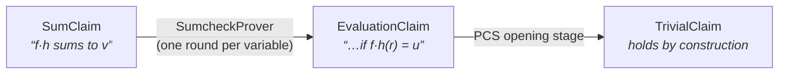
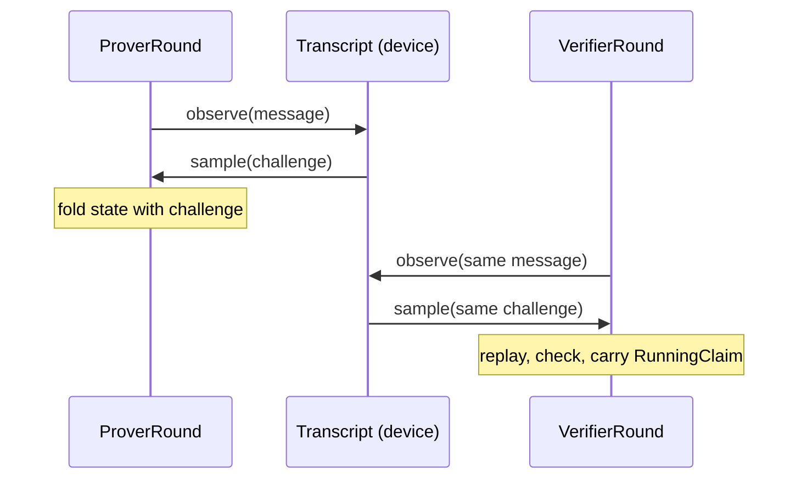

# zorch

**Composable building blocks for SNARKs, running on FRX** — Fractalyze's fork
of JAX with native finite-field dtypes. You assemble a prover the way deep
learning stacks layers: reusable stages, chained until nothing is left to
prove.

## Install

Python **3.11**, Linux x86_64 or macOS Apple Silicon. Install as `pyzorch`,
import as `zorch`:

```sh
pip install pyzorch                    # CPU — nothing else needed
pip install pyzorch 'frx[cuda12]' \
    --extra-index-url https://fractalyze.github.io/pypi/simple/   # GPU (CUDA 12)
python -c "import frx, zorch; print(frx.devices()); print(zorch.__version__)"
```

Platform limits and error symptoms: [Setup](guide/setup.md).

## The mental model

A proof system is a chain of **claim reductions**. Each **stage** has paired
prover/verifier roles; both derive the same reduced claim, and the last claim
holds by construction:



Inside a stage, **rounds** repeat one recurrence — a message observed into the
Fiat-Shamir transcript, a challenge sampled back — and the transcript is a
device-side value threaded through every call:



## Ten lines of working sumcheck

```python
CH = ChallengePolicy(F)
claim = SumClaim(fnp.sum(f * h), n_vars)

prover = SumcheckProver(StandardRound(ProductSummand(2), challenges=CH))
verifier = SumcheckVerifier(SumcheckRound(2, challenges=CH))

proved = prover.prove(claim, SumcheckWitness(fnp.stack([f, h])), cheap_transcript(F))
verified = verifier.verify(claim, proved.reduction_proof, cheap_transcript(F))
assert bool(verified.ok)
```

Full walkthrough with imports — and every other block's entry point:
[Blocks & imports](guide/blocks.md).

## The three sections

<div class="grid cards" markdown>

- :material-tools:{ .lg .middle } **Guide — write code today**

    ***

    Task-oriented: setup, every block's import path with a worked example,
    the field-dtype rules, keeping code fused, assembling a prover.

    [:octicons-arrow-right-24: Start at Setup](guide/setup.md)

- :material-lightbulb-outline:{ .lg .middle } **Design — understand the WHY**

    ***

    Per-block design rationale: why each seam has its shape, the fusion
    contract, conventions. Prose, for reading — not needed to get running.

    [:octicons-arrow-right-24: Overview & fusion north star](README.md)

- :material-api:{ .lg .middle } **API — look up a signature**

    ***

    Typed signatures and docstrings, generated per module from the source
    at build time — never stale.

    [:octicons-arrow-right-24: API reference](api/index.md)

</div>

!!! tip "Using an AI coding agent?"
    The Guide section doubles as an installable agent skill:
    `npx skills add fractalyze/zorch` gives your agent the same pages,
    version-locked to the release you install.
