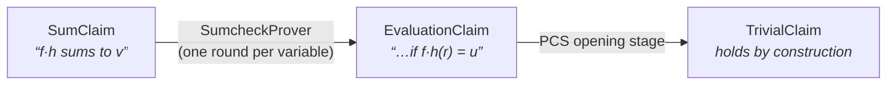
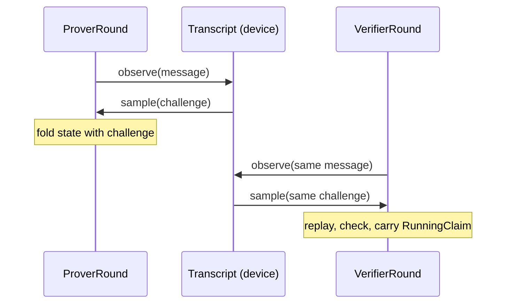

# zorch

**Composable building blocks for SNARKs, running on FRX** — Fractalyze's fork
of JAX with native finite-field dtypes. You assemble a prover the way deep
learning stacks layers: reusable stages, chained until nothing is left to
prove.

<div class="grid cards" markdown>

- :material-download:{ .lg .middle } **Install in one line**

    ***

    `pip install pyzorch` — CPU tier, nothing else needed.
    CUDA 12 wheels via the Fractalyze index.

    [:octicons-arrow-right-24: Getting started](guide/index.md)

- :material-cube-outline:{ .lg .middle } **Blocks, not a framework**

    ***

    Transcripts, polynomials, hashing, Merkle, codes, PCS, sumcheck,
    LogUp-GKR — each reusable across proving schemes.

    [:octicons-arrow-right-24: The blocks](guide/blocks.md)

- :material-vector-combine:{ .lg .middle } **Stages chain claims**

    ***

    Each stage reduces a claim to a smaller one, down to `TrivialClaim`.
    Spartan ships as the worked example.

    [:octicons-arrow-right-24: Building a prover](guide/building-on-zorch.md)

- :material-api:{ .lg .middle } **API from the source**

    ***

    Typed signatures and docstrings, generated per module at build time —
    never stale.

    [:octicons-arrow-right-24: API reference](api/index.md)

</div>

## The mental model

A proof system is a chain of **claim reductions**. Each **stage** has paired
prover/verifier roles; both derive the same reduced claim, and the last claim
holds by construction:



Inside a stage, **rounds** repeat one recurrence — a message observed into the
Fiat-Shamir transcript, a challenge sampled back — and the transcript is a
device-side value threaded through every call:



Ten lines of working sumcheck — prove it, verify it:

```python
CH = ChallengePolicy(F)
claim = SumClaim(fnp.sum(f * h), n_vars)

prover = SumcheckProver(StandardRound(ProductSummand(2), challenges=CH))
verifier = SumcheckVerifier(SumcheckRound(2, challenges=CH))

proved = prover.prove(claim, SumcheckWitness(fnp.stack([f, h])), cheap_transcript(F))
verified = verifier.verify(claim, proved.reduction_proof, cheap_transcript(F))
assert bool(verified.ok)
```

Full walkthrough with imports: [the blocks guide](guide/blocks.md).

## Where to go

| You want to… | Read |
| --- | --- |
| Install and run something | [Getting started](guide/index.md) |
| Find the right block + import path | [Blocks guide](guide/blocks.md) |
| Write field arithmetic that doesn't crash | [Field dtypes](guide/field-dtypes.md) |
| Keep your code fused on GPU | [FRX & fusion](guide/frx-and-fusion.md) |
| Assemble a full prover | [Building on zorch](guide/building-on-zorch.md) |
| Understand a block's design (the WHY) | [Design docs](README.md) |
| Look up a signature | [API reference](api/index.md) |

!!! tip "Using an AI coding agent?"
    The [Guide](guide/index.md) section doubles as an installable agent skill:
    `npx skills add fractalyze/zorch` gives your agent the same pages,
    version-locked to the release you install.
