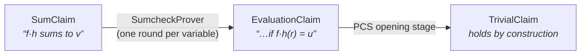
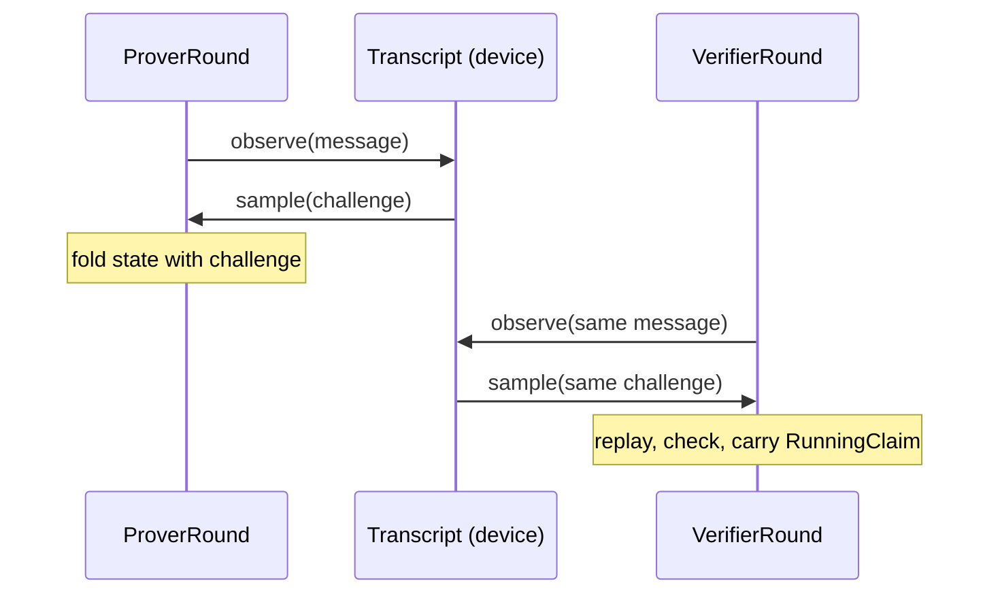

# zorch

**Composable building blocks for SNARKs, running on FRX** — Fractalyze's fork
of JAX with native finite-field dtypes. You assemble a prover the way deep
learning stacks layers: reusable stages, chained until nothing is left to
prove.

## Install

Python **3.11**, Linux x86_64 or macOS Apple Silicon. Install as `pyzorch`,
import as `zorch`:

```sh
pip install pyzorch                    # CPU — nothing else needed
pip install pyzorch 'frx[cuda12]' \
    --extra-index-url https://fractalyze.github.io/pypi/simple/   # GPU (CUDA 12)
python -c "import frx, zorch; print(frx.devices()); print(zorch.__version__)"
```

Platform limits and error symptoms: [Setup](guide/setup.md).

## The mental model

A proof system is a chain of **claim reductions**. Each **stage** has paired
prover/verifier roles; both derive the same reduced claim, and the last claim
holds by construction:



Inside a stage, **rounds** repeat one recurrence — a message observed into the
Fiat-Shamir transcript, a challenge sampled back — and the transcript is a
device-side value threaded through every call:



## Find your door

<div class="grid cards" markdown>

- :material-school:{ .lg .middle } **Get started — learn by doing**

    ***

    Install, prove a sumcheck, verify it, and read what happened — about
    two minutes, CPU only.

    [:octicons-arrow-right-24: First proof](getting-started.md)

- :material-tools:{ .lg .middle } **Guides — get a task done**

    ***

    Assemble a full prover, keep your code fused on GPU, fix install and
    toolchain issues.

    [:octicons-arrow-right-24: Assembling a prover](guide/building-on-zorch.md)

- :material-file-search:{ .lg .middle } **Reference — look it up**

    ***

    Every block's import path with worked examples, the field-dtype sharp
    bits, and the generated API.

    [:octicons-arrow-right-24: Blocks & imports](guide/blocks.md)

- :material-lightbulb-outline:{ .lg .middle } **Design — understand the WHY**

    ***

    Per-block design rationale lives with the code, on GitHub: why each seam
    has its shape, the fusion contract, conventions.

    [:octicons-arrow-right-24: Design docs on GitHub](https://github.com/fractalyze/zorch/blob/main/docs/README.md)

</div>

!!! tip "Using an AI coding agent?"
    The Guide section doubles as an installable agent skill:
    `npx skills add fractalyze/zorch` gives your agent the same pages,
    version-locked to the release you install.
